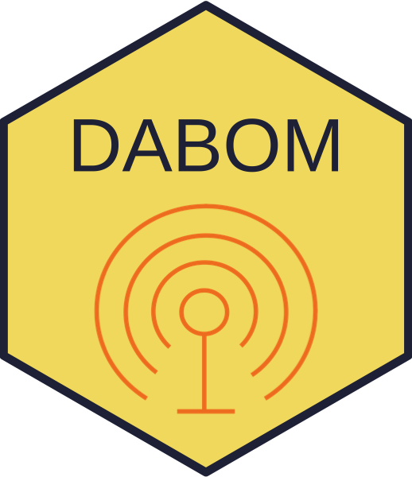

<!-- README.md is generated from README.Rmd. Please edit that file -->

```{r, echo = FALSE}
knitr::opts_chunk$set(
  collapse = TRUE,
  comment = "#>",
  fig.path = "README-"
)
```

# DABOM <a href='https://github.com/KevinSee/DABOM'></a>

[](https://mybinder.org/v2/gh/KevinSee/DABOM/master?urlpath=rstudio)

**D**am **A**dult **B**ranch **O**ccupancy **M**odel

## Description

`DABOM` is an R package for estimating abundance of anadromous fishes using fish tagged at a primary sampling facility (e.g., dam) and later detected in upstream tributaries. It incorporates the branching structure of a stream network, and simultaneously estimates imperfect detection probabilities at all detection locations and movement probabilities past detection locations. The movement probabilities, when multiplied correctly and combined with an estimate of total abundance at the tagging site, can be used to estimate abundance at a variety of spatial scales. Further mathematical details of the model can be found in [Waterhouse, 2020](https://doi.org/10.1002/eap.2202).

The user can find more information related to installation and use of this package on the [package website](https://kevinsee.github.io/DABOM/).

## Installation instructions

```{r child = "man/fragments/install-inst.Rmd"}

```

## Authors

DABOM is a collaborative project, with the primary contributors being:
  
* Kevin See (WDFW)
* Ryan N. Kinzer (Nez Perce Tribe)


### Licenses

**Text and figures :**  [CC-BY-4.0](http://creativecommons.org/licenses/by/4.0/)

**Code :** See the [DESCRIPTION](DESCRIPTION) file

**Data :** [CC-0](http://creativecommons.org/publicdomain/zero/1.0/) attribution requested in reuse

### Contributions

We welcome contributions from everyone. Before you get started, please see our [contributor guidelines](CONTRIBUTING.md). Please note that this project is released with a [Contributor Code of Conduct](CONDUCT.md). By participating in this project you agree to abide by its terms.

